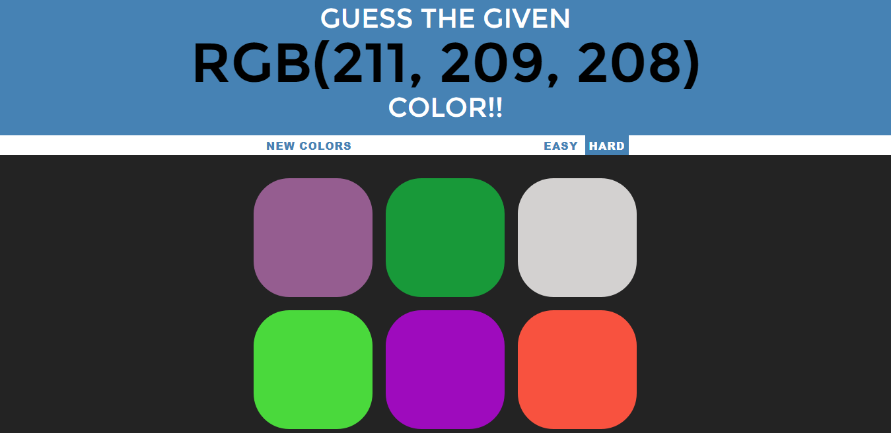
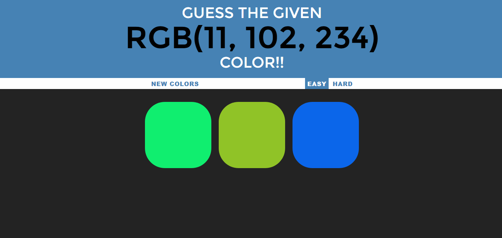
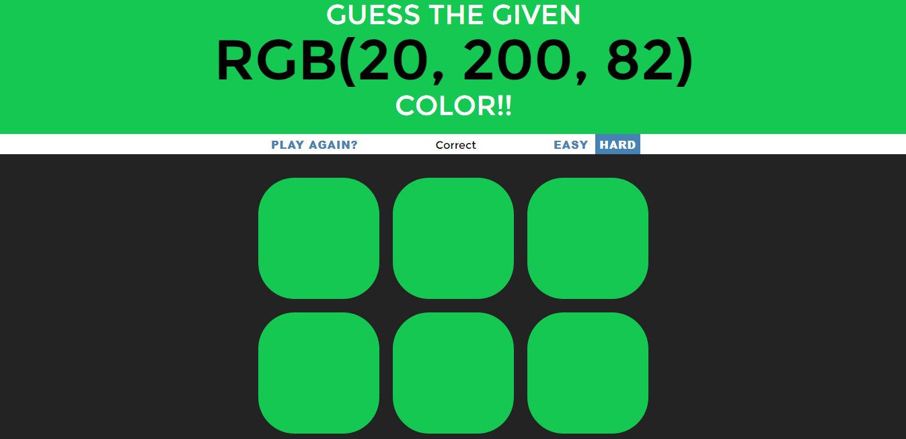

# Color-Game
This web application helps us in getting familiar with colours based on their rbg values.
In this application a rbg value of a particular color will be given and out of the options the user has to select the correct one.
There are two difficulty modes : Easy and Hard.
There are 3 options in easy mode whereas 6 options in hard mode of which only one will be correct.

- Hard mode

- Easy mode

- Winning screen

